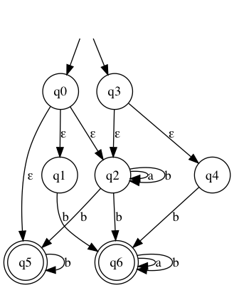
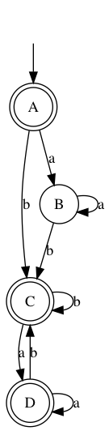

1. git clone git@github.com:evgenymarkov/nfa-converter.git

2. cd nfa-converter/

3. python3 -m venv venv

4. source venv/bin/activate

5. pip3 install -e .

6. run tests from pycharm

NFA-ε

DFA

